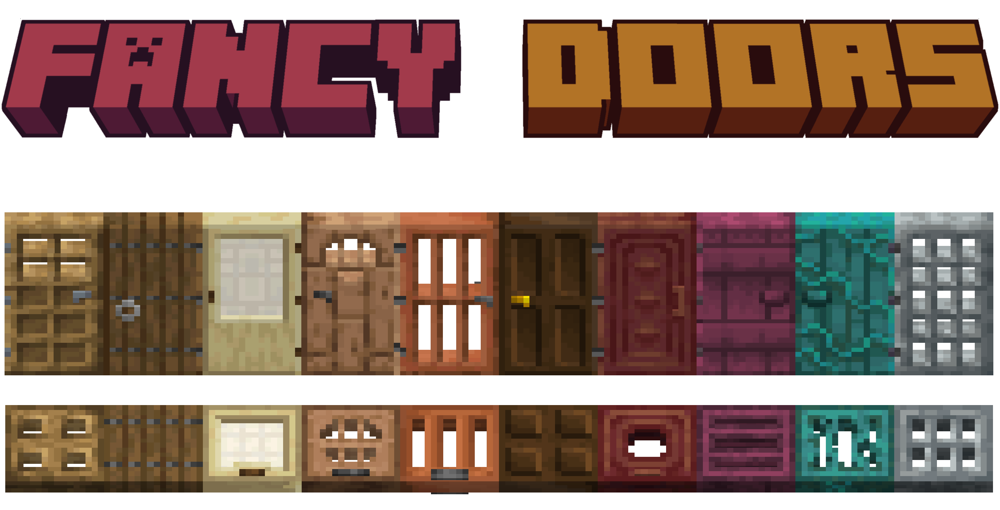
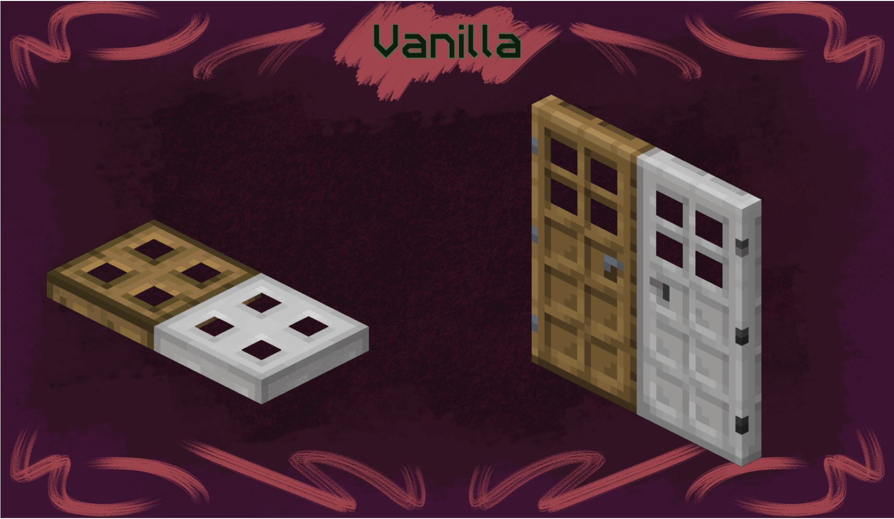
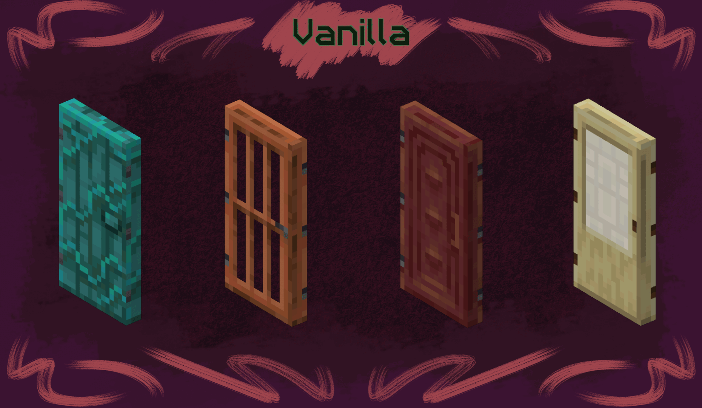
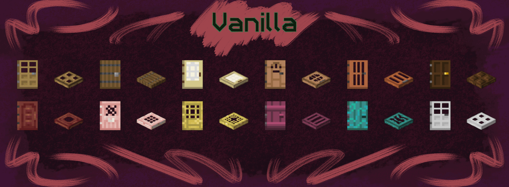

## About

Doors in minecraft are kind of ugly. Their models are flat and boring, their textures look weird in some places and they don't even rotate correctly! How unprofessional.

~~That's why this pack exists! It aims to fix these issues and give doors fancy additions such as:~~

Descriptions are also boring. Here're a showcase instead!

## Install

#### Find your resourcepacks folder

The quickest and easiest way to do this is from in-game.

1. Open up your desired version of Minecraft.
2. Go into "Options" and then "Resource Packs"
3. Click "Open Pack Folder"

#### Download the pack

You can find official releases in all of these places:

- [Github Releases](https://github.com/Xetheon/mc-fancy-doors/releases)
- [Modrinth](https://modrinth.com/resourcepack/fancy-doors)
- [CurseForge](https://www.curseforge.com/minecraft/texture-packs/fancy-doors)

##### If you have any troubles installing, check out the Minecraft Wiki page on [how to install resourcepacks](https://minecraft.fandom.com/wiki/Tutorials/Loading_a_resource_pack).

## Resources

- Want to use these assets in your own works? See the [license](https://github.com/Xetheon/mc-fancy-doors/blob/main/LICENSE.md)
- Curious about updates on things I work on or just want to hang out? Join my [Discord!](https://discord.gg/3gtNAQgv2G)
